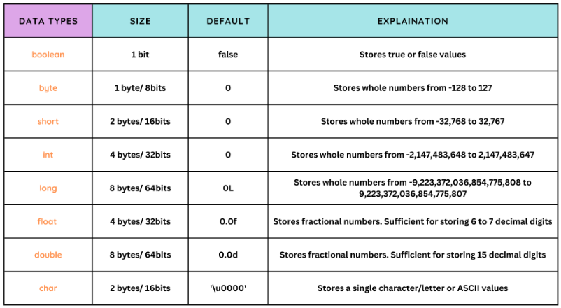
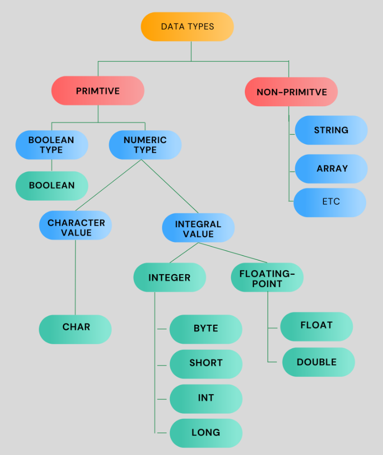
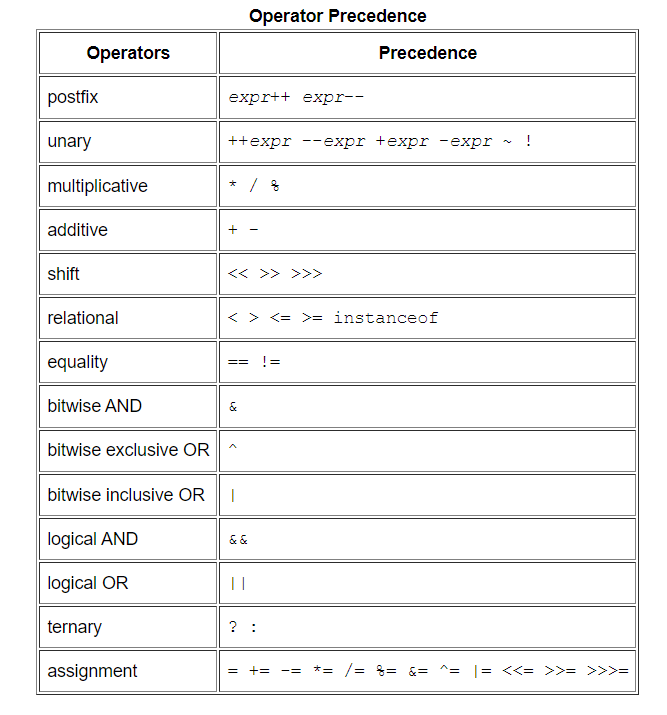

## Java Basics

### <span style="color:#0d6efd">Difference between Java and JavaScript.</span>

---
- JavaScript is scripting language majorly used in web development for front end side scripting
- Where java is compiler based language, used for developing complex applications

---

### <span style="color:#0d6efd">Difference between JDK, JVM, JRE.</span>

---
- **Java Development Kit** - JDK = JRE + Development tools
    1. JDK used for development purpose
- **Java Runtime Environment** - JRE
    1. JRE is runtime environment for executing the java applications
- **Java Virtual Machine** - JVM 
    1. JVM is used to run java bytecode

---

### <span style="color:#0d6efd">What is datatype why we need data type?</span>

---
- datatype is collection of data values
- datatype tells to computer system how to interpret the value of data

---

### <span style="color:#0d6efd">What is variable?</span>

---
- In programming variable is data container to store the data.
- We can change data of the variable.

---

### <span style="color:#0d6efd">Object based vs Object oriented</span>

---
- object based programming doesn't support inheritance 
- object based paradigm is subset of OOP.

---

### <span style="color:#0d6efd">What is difference between framework and library?</span>

---
- framework is full fledge development kit or development cycle
- on other hand library is supporting tools.

---

### <span style="color:#0d6efd">what is method signature?</span>

---
- Method name and Method arguments.
- Ex: isPrime(int num) 
- in example isPrime and num are the method signature.

---

### <span style="color:#0d6efd">why we used static key with method?</span>

---
- static key is related to memory management.
- by using static key word we assign same memory for new instance.

---

### <span style="color:#0d6efd">Java data types.</span>

---



---

### <span style="color:#0d6efd">Java operators.</span>

---


---

### <span style="color:#0d6efd">Experiment on for loop.</span>

---

```java
    for(int i=0; i<5; i++);{
        System.out.println(i);
    }
```
- o/p => 5;

---